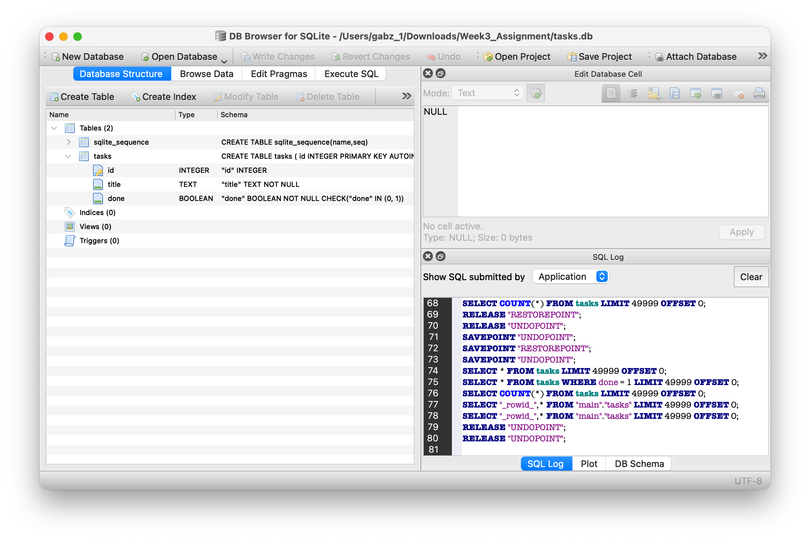
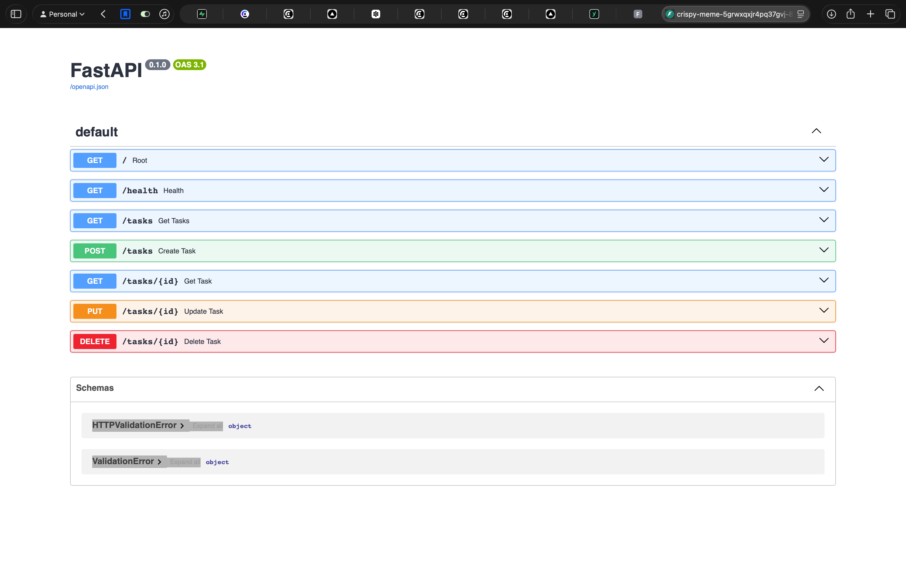

# Week 3 Assignment - Task CRUD API on SQLite

A FastAPI REST API for managing a task list with full CRUD (Create, Read, Update,
Delete) operations. Week 2 kept the tasks in a Python list inside the running
process, so every restart wiped them. Week 3 keeps exactly the same endpoints but
stores the tasks in a SQLite database instead.

The whole app is two files: `main.py` holds the routes and the request/response
models, `db.py` holds the schema and every SQL statement.

## How to run

Run this from the repository root:

```bash
pip install -r requirements.txt && uvicorn main:app --reload
```

The API is then available at `http://localhost:8000`, with interactive docs at
`http://localhost:8000/docs`.

## Why SQLite

- **It is a single file.** The entire database is one `tasks.db` file sitting next
  to the code - simple to inspect, copy, back up, or throw away and rebuild.
- **Zero setup.** There is no database server to install and no connection string
  to configure. The `sqlite3` driver is part of the Python standard library, so the
  command above is the only install step.
- **It survives restarts.** A task created through the API is still there after the
  server is stopped and started again, which is the one thing the in-memory list
  could never do.

## Where the database file lives

`tasks.db`, in the repository root, right beside `main.py` and `db.py`.

- **It is created automatically.** On startup the FastAPI `lifespan` handler calls
  `db.initialise()`, which creates the `tasks` table if it is missing and inserts
  the three starter tasks only when the table is empty. That makes startup
  idempotent: restarting the server never duplicates the seed rows.
- **It is git-ignored.** The database is local state, not source code, so it is
  listed in `.gitignore` and every clone starts fresh, building its own copy on
  the first run.
- **It does not follow your shell around.** `db.py` resolves the location as
  `Path(__file__).resolve().parent / "tasks.db"` - an absolute path anchored to the
  module - so the file always lands next to the code even if uvicorn was started
  from some other directory. A bare relative `"tasks.db"` would scatter half-empty
  databases wherever the server happened to be launched.

## Schema

```sql
CREATE TABLE IF NOT EXISTS tasks (
    id    INTEGER PRIMARY KEY,
    title TEXT    NOT NULL CHECK (length(trim(title)) > 0),
    done  INTEGER NOT NULL DEFAULT 0 CHECK (done IN (0, 1))
);
```

| Column  | Type    | Notes                                                                             |
|---------|---------|-----------------------------------------------------------------------------------|
| `id`    | INTEGER | Primary key. As an alias for SQLite's `rowid` it is assigned automatically on insert. |
| `title` | TEXT    | Required. The CHECK rejects a title that is empty or nothing but whitespace.        |
| `done`  | INTEGER | 0 or 1 only, defaults to 0.                                                        |

**SQLite has no boolean type.** It stores true and false as the integers 1 and 0,
which is why `done` is an INTEGER column with `CHECK (done IN (0, 1))` to keep any
other value out. `db.py` converts it back with `bool(row["done"])` on the way out,
so the API still returns proper JSON `true` / `false` and clients never deal with
the 0/1 representation.

Both CHECK constraints are real defences, not decoration: they hold even when rows
are written from the `sqlite3` CLI or DB Browser rather than through the API. The
API refuses the same bad data earlier - `title` is stripped of surrounding
whitespace and then required to be non-empty by the Pydantic model, so `"   "` is a
clean 422 instead of a 500 raised by the database.

## Endpoints

| Method | Path          | Description                            | Success                     | Errors                                          |
|--------|---------------|----------------------------------------|-----------------------------|-------------------------------------------------|
| GET    | `/`           | API info                               | `200 OK`                    | -                                               |
| GET    | `/health`     | Health check                           | `200 OK`                    | -                                               |
| GET    | `/tasks`      | List every task, lowest id first       | `200 OK`                    | -                                               |
| GET    | `/tasks/{id}` | Fetch one task                         | `200 OK`                    | `404` unknown id, `422` non-integer id          |
| POST   | `/tasks`      | Create a task                          | `201 Created` + `Location`  | `422` invalid body                              |
| PUT    | `/tasks/{id}` | Replace a task                         | `200 OK`                    | `404` unknown id, `422` invalid body            |
| DELETE | `/tasks/{id}` | Delete a task                          | `204 No Content`, empty body| `404` unknown id, `422` non-integer id          |

A few rules the status codes depend on:

- **`PUT` is a full replacement.** Both `title` and `done` are required. Sending
  only one of them is a `422`, never a silent overwrite of the missing field with
  a default. `POST` is the exception: `done` may be omitted and defaults to `false`.
- **Unknown fields are rejected.** The models are configured with
  `extra="forbid"`, so `{"title": "Read", "prioriy": "high"}` is a `422` that names
  the offending field instead of a `201` that quietly drops the typo.
- **`DELETE` returns no body.** A `204` response carries zero bytes; deleting the
  same id twice gives `204` then `404`.

## Example requests

```bash
# Get all tasks
curl -i http://localhost:8000/tasks

# Get a specific task
curl -i http://localhost:8000/tasks/1

# Create a new task - responds 201 with a Location header pointing at the new task
curl -i -X POST http://localhost:8000/tasks \
  -H "Content-Type: application/json" \
  -d '{"title": "Study FastAPI", "done": false}'

# Replace a task - both fields are required
curl -i -X PUT http://localhost:8000/tasks/1 \
  -H "Content-Type: application/json" \
  -d '{"title": "Study FastAPI", "done": true}'

# Delete a task - responds 204 with an empty body
curl -i -X DELETE http://localhost:8000/tasks/1
```

## Looking at the database

The file can be opened directly in [DB Browser for SQLite](https://sqlitebrowser.org/),
which is the quickest way to confirm that data written through the API really is on
disk:



## Swagger UI

The interactive docs at `/docs` (screenshot captured in Week 2; the endpoint set is
unchanged):



## Exploring the database with SQL

Everything below was run against `tasks.db` with the `sqlite3` command-line tool
(version 3.51.0) after starting the server once on a fresh database, so the table
holds only the three seeded tasks. The output is copied verbatim.

**The schema SQLite actually stored**

```
$ sqlite3 tasks.db ".schema tasks"
CREATE TABLE tasks (
    id    INTEGER PRIMARY KEY,
    title TEXT    NOT NULL CHECK (length(trim(title)) > 0),
    done  INTEGER NOT NULL DEFAULT 0 CHECK (done IN (0, 1))
);
```

**Read the whole table**

```
$ sqlite3 tasks.db -header -column "SELECT * FROM tasks;"
id  title          done
--  -------------  ----
1   Clean room     0
2   Buy groceries  1
3   Walk the dog   0
```

`done` comes back as `0` / `1` because SQLite has no boolean type; the API turns
it back into `true` / `false` on the way out.

**Filter by `done`**

```
$ sqlite3 tasks.db -header -column "SELECT id, title FROM tasks WHERE done = 0;"
id  title
--  ------------
1   Clean room
3   Walk the dog
```

**Count how many tasks are in each state**

```
$ sqlite3 tasks.db -header -column "SELECT done, COUNT(*) AS total FROM tasks GROUP BY done;"
done  total
----  -----
0     2
1     1
```

**The CHECK constraints rejecting bad data**

A title that is only whitespace is refused by the database itself, not just by
the API:

```
$ sqlite3 tasks.db "INSERT INTO tasks (title, done) VALUES ('   ', 0);"
Error: stepping, CHECK constraint failed: length(trim(title)) > 0 (19)
```

So is a `done` value that is not 0 or 1:

```
$ sqlite3 tasks.db "UPDATE tasks SET done = 2 WHERE id = 1;"
Error: stepping, CHECK constraint failed: done IN (0, 1) (19)
```

Both statements failed, so nothing was written - the table is untouched:

```
$ sqlite3 tasks.db -header -column "SELECT COUNT(*) AS total FROM tasks;"
total
-----
3
```

## AI vs Me

This is the Week 3 comparison: my own SQLite migration lives on `main`, this branch
is the AI's independent migration of the same in-memory app.

### The prompt I gave it

> Now, create another branch named as ai-branch (for this week3).
>
> Then under this branch, implement the change from in-memory database to sql
> database. Start from stage 0-stage 5. Implement using the highest model available
> (Opus 5). Apply more professional and strict but standard coding standards
>
> C H E C K P O I N T — your README has an "AI vs me" section containing your full
> prompt and at least three concrete differences you found.
> Commit: Stage 6: AI vs me
>
> NOTE: Do not modify my own code, generate your own.

Followed up with:

> handle it differently by not looking in my code

### How this was actually set up

The assistant I was talking to had already read my `db.py` and `main.py` earlier in
the session, so it could not write the comparison implementation itself. Stages 0–5
were handed to a separate agent working in a `git clone --no-local --single-branch`
of the base commit — a clone that contains none of `main`'s commits or blobs, which
I verified with `git cat-file -e` before it started. It was given the coding
standards up front and never saw my solution. So the standards were specified, and
the implementation was written blind; the differences below were found afterward by
running both versions.

Both branches start from the same commit, `7f72df7` — the last one where `main.py`
still held the in-memory list.

### The differences

Every difference below was found by running both implementations and recording the
real responses, not by reading the code and guessing.

**1. A failed write on my version leaves the database locked against other programs.**

On `main`, a `POST /tasks` with no title returns `500`, and the failed write leaves
the process holding SQLite's write lock. Anything else touching the same file is
then locked out. Tested with a control, three runs, identical every time:

```
                          main            ai-branch
outside write, healthy    SUCCEEDED       SUCCEEDED     <- baseline
POST /tasks {}            500             422
outside write, after      BLOCKED         SUCCEEDED     <- database is locked (5)
API's own next write      200             204
```

The "outside write" is a plain `sqlite3` CLI insert against the same file, standing
in for DB Browser or a second server. On a healthy server it succeeds; after one bad
request to `main` it fails with `database is locked`. On `ai-branch` it still
succeeds, because the invalid body is rejected by the model and no SQL ever runs.

Note the last row: **the API's own writes keep working on both.** A bad request does
not brick my API. The cost is narrower than that — it means I cannot open `tasks.db`
in DB Browser to inspect it after a bad request has hit the server, which is exactly
what I was doing in Stage 4.

I want to be honest about how I got here, because I nearly wrote something false. My
first run of this test showed every subsequent write failing with `500` forever, and
I was ready to report that a single bad request permanently bricks the API. It
didn't reproduce. The cause was a leftover test server of my own still running
against the same file — my result, not my bug. Re-running with a proper control and
three repeats gave the table above. I also can't blame the stray `tasks.db-journal`
I committed in Stage 4 on this; it could equally have come from an interrupted
`python db.py` run, and I didn't check at the time.

**2. My `POST` writes to the database before it checks the input.**

`main.py` runs the `INSERT` first and only then tests whether `title` was provided,
so the `NOT NULL` constraint raises before my `400` is ever reached. The client gets
a `500` for what is plainly a bad request. The AI validates in a Pydantic model, so
an invalid body is a `422` and no SQL runs at all — I confirmed the row count was
unchanged after a rejected create.

This is the same bug the Week 2 reflection below caught in my in-memory version. I
carried it across the SQLite rewrite without noticing.

**3. My `PUT` silently un-completes a task.**

Task 2 was `done: true`. I sent a `PUT` with only a title:

```
PUT /tasks/2 {"title": "Wire up SQLite"}   -> 200
GET /tasks/2  ->  {"id":2, "title":"Wire up SQLite", "done":false}
```

`task.get("done", False)` defaults the missing field to `False`, so renaming a
finished task quietly marks it unfinished and returns `200` as if nothing happened.
Silent data loss with a success code is worse than an error. The AI treats `PUT` as
a full replacement — both fields required, missing one is a `422`. Going the other
way, `PUT` with only `done` returns `500` on mine, because `title` becomes `None`
and hits `NOT NULL`.

**4. Bad data my schema accepts.**

My `title` column is only `NOT NULL`, so a whitespace-only title is stored happily:

```
POST /tasks {"title":"   "}  ->  200, stored as "   "
```

The AI's schema has `CHECK (length(trim(title)) > 0)`, and its model strips
whitespace before the length check, so the same request is a `422` — and the
constraint still holds if someone writes to the file through DB Browser instead of
the API.

**5. Unknown fields vanish silently on mine.**

`POST /tasks {"title":"probe","bogus":123}` returns `200 Created` on `main` and the
extra field is dropped without comment, because the handler takes a bare `dict`. The
AI's models set `extra="forbid"`, so a typo'd field name is a `422` that names the
offending field. A client misspelling `done` would look successful against my
version forever.

**6. My status codes live in the response body instead of the status line.**

Creating a task on `main` returns HTTP **200** with this body:

```json
{"201": "Created", "task": {"id": 4, "title": "probe", "done": false}}
```

The `201` is a JSON key, not the status code — so anything checking the HTTP status
sees a plain `200`, and no `Location` header points at the new resource. Delete
likewise returns `200` with `{"message": "Task 4 deleted"}`. The AI returns a real
`201` with `Location: /tasks/4`, and a real `204` with a genuinely empty body.

**7. My database layer hides its own failures.**

Every function in my `db.py` wraps its work in `except sqlite3.Error as e: print(e)`.
A failed write prints to the server console and returns normally, so the caller
cannot tell success from failure. `create_connection()` also returns `None` on
error rather than raising. (This one I found by reading the code, not by triggering
it — unlike the differences above, I have not made it fail in practice.) The AI's
`db.py` has exactly one `try`, in a context manager that commits on success, rolls
back on exception and re-raises. Difference 1 is what the missing rollback costs.

**8. My database follows the shell around.**

`db_name = "tasks.db"` is a relative path, so starting the server from another
directory creates a second, empty database there. The AI anchors it with
`Path(__file__).resolve().parent / "tasks.db"`, and verified that launching from an
unrelated directory left that directory empty.

**9. Reading rows by position vs by name.**

Mine does `SELECT *` and then `task[0]`, `task[1]`, `task[2]`. That silently breaks
the moment a column is added or reordered. The AI sets `sqlite3.Row` as the row
factory, lists columns explicitly, and reads `row["title"]`.

### What I take from this

The pattern in almost all of these is the same: my version reports success when
something has gone wrong. A `200` on a partial `PUT` that destroyed a field, a `200`
on a create with a typo'd field name, a `200` carrying `{"201": "Created"}`, and a
`print()` where an exception belonged. The AI's version fails loudly and early, and
the reason it comes out of a bad request cleanly is not that it is cleverer — it is
that validation happens before the database is touched, and one context manager owns
the rollback.

The other thing I take from this is about testing rather than code. My most dramatic
finding was wrong, and it was wrong because my test environment was dirty, not
because the code did what I thought. It looked convincing — a `500`, then another
`500`, still failing ten seconds later. It took a control run and three repeats to
show that a leftover process of mine was holding the lock the whole time. A result
that confirms what you expect is the one worth re-running.

The honest caveat: the AI was told up front to use Pydantic validation, proper status
codes and a rollback-owning context manager. It did not deduce those from nowhere.
What it was not told was anything about my code, and it still ended up making the
opposite choice at every point where mine reports a false success.

## AI vs Me (Week 2 reflection)

_Written in Week 2, about the pre-SQLite version of this API that stored its tasks
in an in-memory Python list._

I gave an AI a prompt describing this same API from scratch, on a separate `ai-branch`, without letting it see my code. Comparing the two afterward:

**What did the AI do better — and do I understand it well enough to explain it?**
It is much more advanced and specific compared to my handwritten logic. It caught a real bug I didn't notice: my `POST /tasks` appends the new task to the list *before* checking whether `title` was provided, so a bad request still pollutes the data even though it returns a 400. The AI's version validates through a Pydantic model before the handler ever runs, so that class of bug can't happen there. It also uses consistent status codes (`201` on create, `422` on bad input) where mine leans on `400` everywhere. Yes — I understand why it works, it's standard FastAPI/Pydantic, nothing I'd need to look up.

**What did it get wrong or quietly ignore from my prompt?**
I typed "GET /task" (singular) in my prompt; it silently pluralized it to `/tasks` without flagging that it changed my wording. It also dropped `id` from the request body on create entirely — I'd described the task object as `{id, title, done}`, which reads like `id` is something a client could send, but the AI decided server-side auto-increment instead and didn't call out that it was overriding that.

**What did my prompt forget to specify — and what did the AI silently decide for me?**
I never said whether `PUT` should be a full or partial update, it chose "both fields required." I never gave a minimum title length, it picked `min_length=1` on its own. I also never said what a successful `DELETE` should return — it invented a `{"message": ...}` body instead of a plain `204 No Content`. And I never thought about concurrency at all, which its task counter is a bare global int, not safe under concurrent requests, and I didn't catch that until I went looking for what it had assumed.
